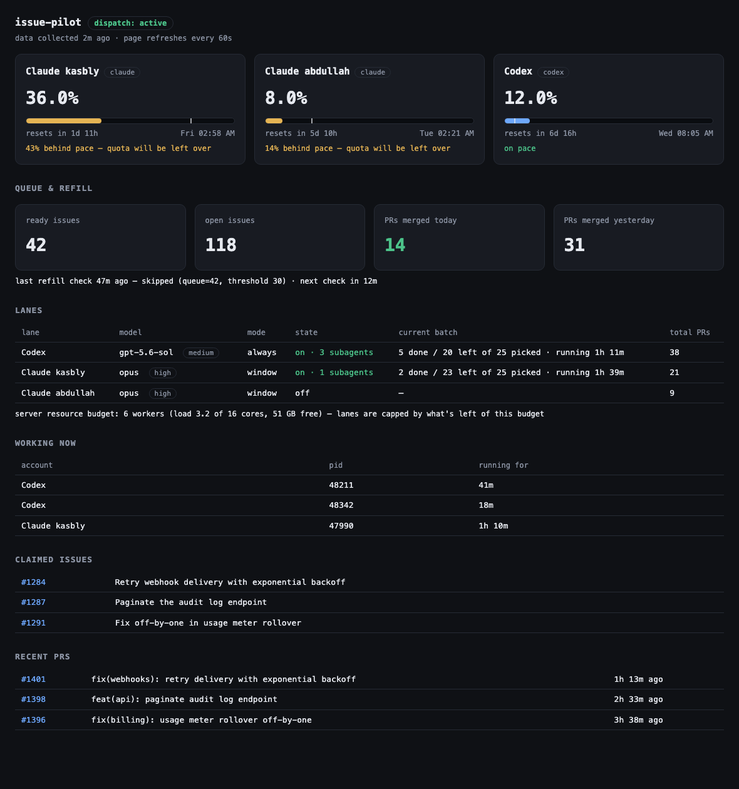

# issue-pilot

**An autonomous issue implementer that runs as an infinite loop.** AI scanner
agents read your codebase and file real GitHub issues; AI worker lanes (Claude,
Codex — any CLI agent) claim them and implement them into merged PRs; and when
the queue runs low, the scanner refills it. Unattended, around the clock:

> **scan → file issues → implement → PR → CI → merge → queue low? → scan again → ∞**

A pacer meters the whole machine against your AI subscriptions — each lane speeds
up or slows down so every weekly quota is *fully* used by its reset, and none of
it expires unspent. A resource governor keeps the loop from eating the server.

```bash
npm install -g @kasbly/issue-pilot
```

Under the hood: three small loops in plain bash + `gh` + systemd. No daemon
framework, no database — GitHub Issues **is** the queue, labels **are** the
state machine, and every agent-specific behavior is a shell command in one
config file.



```
┌─────────┐  queue low   ┌──────────┐  ready issues  ┌──────────┐   ┌─ subagent ─► PR ─► CI ─► merge?
│ refill  │ ───────────► │  GitHub  │ ◄────────────  │ dispatch │──►│─ subagent ─► …
│ (timer) │  run scanner │  Issues  │  claim labels  │ (daemon) │   └─ subagent ─► …
└─────────┘              └──────────┘                └──────────┘   one batch session,
                                                          ▲         CONCURRENCY at a time
                                     state/concurrency    │
                                                     ┌─────────┐
                                     quota vs ideal  │  pace   │
                                     burn line       │ (timer) │
                                                     └─────────┘
```

## The three loops

| Loop | Unit | What it does |
|---|---|---|
| **refill** | `issue-pilot-refill.timer` (hourly) | Counts open issues with `READY_LABEL`. Below `REFILL_THRESHOLD`? Runs your `SCANNER_CMD` to generate more. |
| **dispatch** | `issue-pilot-dispatch.service` (always on) | Runs one batch session per **active lane**. Each batch works through up to `BATCH_SIZE` ready issues, spawning subagents at the lane's concurrency. Issues are claimed with `CLAIM_LABEL` plus a "claimed by" comment (the tie-breaker between parallel lanes), un-claimed on failure so they re-queue. |
| **pace** | `issue-pilot-pace.timer` (every 2 h) | Sets each lane's concurrency in `state/lane-<id>.concurrency`: `always` lanes get their fixed number; `window` lanes activate only near their quota reset (see below). |

## Install

Via npm:

```bash
npm install -g @kasbly/issue-pilot
issue-pilot init /opt/issue-pilot    # scaffolds conf, state/, web/, templated systemd units
issue-pilot doctor                   # checks gh/jq/curl/flock/envsubst and gh auth
$EDITOR /opt/issue-pilot/issue-pilot.conf
sudo cp /opt/issue-pilot/systemd/* /etc/systemd/system/ && sudo systemctl daemon-reload
sudo systemctl enable --now issue-pilot-refill.timer issue-pilot-pace.timer \
  issue-pilot-dispatch.service issue-pilot-status.timer issue-pilot-web.service
```

Or from a git clone (code and working dir in one place):

```bash
git clone https://github.com/kasbly/issue-pilot /opt/issue-pilot
cd /opt/issue-pilot
cp issue-pilot.conf.example issue-pilot.conf
$EDITOR issue-pilot.conf            # set repo, labels, lanes, scanner command
cp systemd/* /etc/systemd/system/
systemctl daemon-reload
systemctl enable --now issue-pilot-refill.timer issue-pilot-pace.timer issue-pilot-dispatch.service
```

Cloned somewhere other than `/opt/issue-pilot`? Update the paths in the unit files
(`issue-pilot init` does this templating for you). Needs: `bash`, `gh` (authenticated),
`jq`, `curl`, `awk`, `flock`, `envsubst`. Run `./test.sh` to verify the pacer math.

## The three commands you plug in

Everything agent-specific lives in your config as shell commands. The example files
under `examples/` are pure prompts — no headers or commentary — because headless
agents treat anything that reads like documentation as an invitation to discuss
instead of act. Keep them that way when you adapt them.

- **`SCANNER_CMD`** — generates issues. Start from [examples/scanner.md](examples/scanner.md):
  `claude -p "$(cat examples/scanner.md)"`. Wave-size tip: many smaller waves beat one
  giant dump — quality stays high and usage spreads across the week, which is exactly
  what the pacer wants.
- **Lanes** — one per subscription that implements issues, defined by `LANES` +
  `LANE_<id>_*` vars (label, mode, command, limits — everything overridable per lane).
  Each lane's `CMD` is an orchestrator session built from [examples/goal.md](examples/goal.md):
  it claims ready issues (`ISSUE_ORDER` picks oldest- or newest-first), fans out
  subagents, and each subagent implements one issue end to end — worktree off
  `origin/$BASE_BRANCH`, PR from a `pilot-<lane>/issue-N` branch, watch CI and fix
  failures (max 3 rounds), then merge if `AUTO_MERGE=true` or leave for review.
  Session output lands in `state/batch-<lane>.log`.
- **Usage reading** (window lanes) — [bin/usage-claude.sh](bin/usage-claude.sh) reads
  the exact numbers Claude Code's `/usage` screen shows (OAuth usage endpoint + the
  lane's `CREDENTIALS` file) — no calibration needed. Other providers: set
  `LANE_<id>_USAGE_CMD` to anything printing `<pct_used> <secs_until_reset>`.

## /goal — the same thing, interactively

[commands/goal.md](commands/goal.md) is the batch goal as a Claude Code slash command.
Copy it into your repo's `.claude/commands/` (or `~/.claude/commands/`) and run:

```
/goal implement 100 issues, oldest first, base dev, merge when green
```

Count, order, base branch, merge policy, concurrency, and label filters are all
parsed from the request; anything unstated falls back to sane defaults (10 issues,
oldest first, repo default branch, no auto-merge, 3 subagents).

## Lane modes — the pacing model

- **`always`** — the workhorse subscription (typically the one that resets often and
  exists to be burned). Runs whenever ready issues exist, at a fixed `CONCURRENCY`.
  No pacing: pacing a workhorse only slows it down.
- **`window`** — the pace follower, for subscriptions you also use interactively.
  The ideal line runs 0% right after the account's reset to 100% at the next one.
  Whenever usage falls more than `PACE_TOLERANCE_PCT` behind that line, the lane
  runs enough workers to close the gap within `CATCHUP_HOURS` —
  `deficit / (CATCHUP_HOURS × BURN_PCT_PER_WORKER_HOUR)`, clamped to
  `[MIN_CONCURRENCY, MAX_CONCURRENCY]` — then idles once back on pace. Your own
  interactive use pushes the account ahead of the line and the lane simply stays
  quiet; quiet days pull it behind and the lane fills them with issue work. The
  quota lands at ~100% by every reset, all week long, hands-off. Raise
  `PACE_TOLERANCE_PCT` to keep more slack for yourself.
- **`off`** — parked.

Every knob has a global default and a per-lane `LANE_<id>_…` override. Concurrency
changes fire `NOTIFY_CMD` (point it at ntfy/Telegram/Slack). A running batch keeps
the concurrency it started with; changes apply from the next batch.

## Promote — the release loop (optional)

With `PROMOTE_ENABLED=true` (requires `AUTO_MERGE=true`), an hourly timer counts the
commits sitting on `BASE_BRANCH` that haven't reached `STAGING_BRANCH`. Once
`PROMOTE_AFTER_COMMITS` pile up, one strong agent session
([examples/promote.md](examples/promote.md)) promotes the frozen candidate to
production through PRs — `base → staging → prod`, merge commits only, one-way —
**fixing CI as it goes** (repairs land on the base branch first, then get
cherry-picked onto the frozen candidate). It verifies ancestry and deployment, then
reports. Manual run: `issue-pilot promote --now`. Start manual for the first few
releases; enable the timer once you trust the reports. If you can, reserve CI
runners for promotion jobs so releases never queue behind the worker lanes.

## Status page

`issue-pilot-web.service` serves `web/` (bind it to a private/VPN interface — it
exposes usage data), and `issue-pilot-status.timer` refreshes `web/status.json` every
5 minutes: every account's used %, reset countdown, and pace verdict; each lane's
state and current-batch progress (picked / done / left); live worker sessions mapped
to the account burning them; claimed issues and recent PRs.

## Notes

- One dispatcher per repo. The claim label is the mutex; a single orchestrator
  session claiming before delegating means no races.
- Killing the dispatcher mid-batch orphans claimed-but-unfinished issues: remove
  `CLAIM_LABEL` by hand (`gh issue edit N --remove-label in-pilot`) or let the batch
  finish first.
- Keep `BATCH_SIZE` modest (≤25): smaller batches survive session/context limits,
  and a crashed session costs at most one batch, not the whole backlog.

---

Built by [Kasbly](https://kasbly.com), where issue-pilot runs in production —
three AI subscriptions grinding through one product backlog around the clock.
