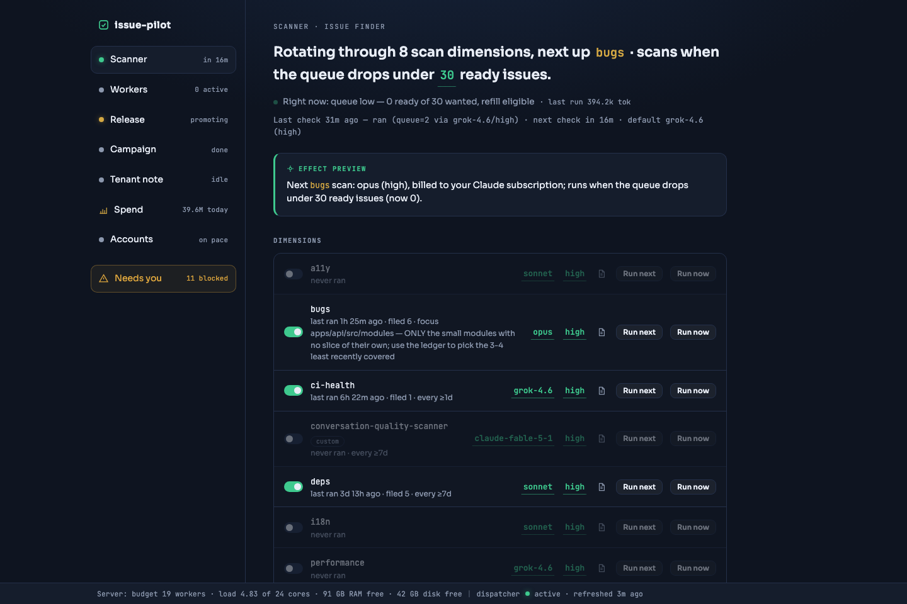

# issue-pilot

**An autonomous issue implementer that runs as an infinite loop.** AI scanner
agents read your codebase and file real GitHub issues; AI worker lanes (Claude,
Codex, Grok Build — any CLI agent) claim them and implement them into merged PRs;
and when the queue runs low, the scanner refills it. Unattended, around the clock:

> **scan → file issues → implement → PR → CI → merge → queue low? → scan again → ∞**

A pacer meters the whole machine against your AI subscriptions — each lane speeds
up or slows down so every weekly quota is *fully* used by its reset, and none of
it expires unspent. A resource governor keeps the loop from eating the server, a
set of janitors keeps the queue honest, and a release loop promotes what landed
to production. A status panel — the mission desk — shows and edits all of it.

```bash
npm install -g @kasbly/issue-pilot
```

Under the hood: small loops in plain bash + `gh` + systemd. No daemon framework,
no database — GitHub Issues **is** the queue, labels **are** the state machine,
and every agent-specific behavior is a shell command in one config file.



```
┌─────────┐  queue low   ┌──────────┐  ready issues  ┌──────────┐   ┌─ subagent ─► PR ─► CI ─► merge?
│ refill  │ ───────────► │  GitHub  │ ◄────────────  │ dispatch │──►│─ subagent ─► …
│ (timer) │  run scanner │  Issues  │  claim labels  │ (daemon) │   └─ subagent ─► …
└─────────┘              └──────────┘                └──────────┘   one batch session,
                                                          ▲         CONCURRENCY at a time
                                     state/concurrency    │
                                                     ┌─────────┐
                                     quota vs ideal  │  pace   │
                                     burn line       │ (timer) │
                                                     └─────────┘
```

## The loops

| Loop | Unit | What it does |
|---|---|---|
| **refill** | `issue-pilot-refill.timer` (hourly) | Runs the janitors, then counts open issues with `READY_LABEL`. Below `REFILL_THRESHOLD`? Picks the next scanner dimension and runs `SCANNER_CMD` (or its Codex fallback) on the account with the most headroom. |
| **dispatch** | `issue-pilot-dispatch.service` (always on) | One batch session per **active lane**. Each batch works through up to `BATCH_SIZE` ready issues, spawning subagents at the lane's concurrency. Issues are claimed with `CLAIM_LABEL` plus a "claimed by" comment (the tie-breaker between parallel lanes), un-claimed on failure so they re-queue. |
| **pace** | `issue-pilot-pace.timer` (hourly) | Writes each lane's concurrency to `state/lane-<id>.concurrency`: `always` lanes get their fixed number, `window` lanes follow their account's burn line, and the server's resource budget is split across lanes by pace headroom. |
| **promote** | `issue-pilot-promote.timer` (hourly) | Counts commits waiting on `BASE_BRANCH`; past `PROMOTE_AFTER_COMMITS`, releases them to production in verified rounds. |
| **campaign** | `issue-pilot-campaign.timer` (every 2 h) | If a campaign is active and its issues are nearly drained, runs a gap analysis against the goal and files what is missing. |
| **status** | `issue-pilot-status.timer` (5 min) + `issue-pilot-web.service` | Refreshes `web/status.json` and serves the panel with its write API. |

## Install

Via npm:

```bash
npm install -g @kasbly/issue-pilot
issue-pilot init /opt/issue-pilot    # scaffolds conf, state/, web/, templated systemd units
issue-pilot doctor                   # checks gh/jq/curl/flock/envsubst and gh auth
$EDITOR /opt/issue-pilot/issue-pilot.conf
sudo cp /opt/issue-pilot/systemd/* /etc/systemd/system/ && sudo systemctl daemon-reload
sudo systemctl enable --now issue-pilot-refill.timer issue-pilot-pace.timer \
  issue-pilot-dispatch.service issue-pilot-status.timer issue-pilot-web.service
```

Or from a git clone (code and working dir in one place):

```bash
git clone https://github.com/kasbly/issue-pilot /opt/issue-pilot
cd /opt/issue-pilot
cp issue-pilot.conf.example issue-pilot.conf
$EDITOR issue-pilot.conf            # set repo, labels, lanes, scanner command
cp systemd/* /etc/systemd/system/
systemctl daemon-reload
systemctl enable --now issue-pilot-refill.timer issue-pilot-pace.timer issue-pilot-dispatch.service
```

Cloned somewhere other than `/opt/issue-pilot`? Update the paths in the unit files
(`issue-pilot init` does this templating for you). Needs: `bash`, `gh` (authenticated),
`jq`, `curl`, `awk`, `flock`, `envsubst`, `python3` (panel + cost ledger). Run
`./test.sh` to verify the pacer math. Add `issue-pilot-promote.timer` and
`issue-pilot-campaign.timer` when you turn those loops on.

## Commands

| Command | Does |
|---|---|
| `issue-pilot init [dir]` | scaffold a working dir (conf, `state/`, `web/`, `examples/`, systemd units with real paths) |
| `issue-pilot doctor` | check dependencies and `gh` auth |
| `issue-pilot refill` / `pace` / `status` | run that loop once |
| `issue-pilot promote [--now]` | run the release check once; `--now` skips the enabled/threshold gates |
| `issue-pilot announce [--dry-run]` | post (or preview) the release note for commits shipped since the last one |
| `issue-pilot campaign set "<goal>" \| pause \| resume \| done \| status \| tick` | drive the goal loop |
| `issue-pilot dispatch` | the dispatcher loop in the foreground (what systemd runs) |
| `issue-pilot version` | package version |

## The commands you plug in

Everything agent-specific lives in your config as shell commands. The example files
under `examples/` are pure prompts — no headers or commentary — because headless
agents treat anything that reads like documentation as an invitation to discuss
instead of act. Keep them that way when you adapt them.

- **`SCANNER_CMD`** — generates issues. Ten scanner methodologies ship in
  [scanners/](scanners/) (bugs, security, performance, deps, i18n, a11y, product-gap,
  test-gaps, ci-health, prod-errors); your working dir's `scanners/` overrides them by
  filename, then the scanned repo's `scanners/`, and a `scanners/CONTEXT.md` in the
  scanned repo injects repo-specific rules into every run. Start from
  [examples/scanner.md](examples/scanner.md) and reference `$SCANNER_RUN_MODEL` /
  `$SCANNER_RUN_EFFORT` so the per-dimension settings below apply.
- **Lanes** — one per subscription that implements issues, defined by `LANES` +
  `LANE_<id>_*` vars (label, mode, command, model/effort, limits — everything
  overridable per lane). Each lane's `CMD` is an orchestrator session built from
  [examples/goal.md](examples/goal.md): it claims ready issues (`ISSUE_ORDER` picks
  oldest- or newest-first, campaign issues first), fans out subagents, and each
  subagent implements one issue end to end — worktree off `origin/$BASE_BRANCH`, PR
  from a `pilot-<lane>/issue-N` branch, watch CI and fix failures, then merge with
  `MERGE_METHOD` if `AUTO_MERGE=true` or leave for review. Session output lands in
  `state/batch-<lane>.log`.
- **Usage reading** — `bin/usage-claude.sh` reads the exact numbers Claude Code's
  `/usage` screen shows (OAuth usage endpoint + the lane's `CREDENTIALS` file);
  `bin/usage-codex.sh` reads the rate-limit snapshot in the newest Codex session
  (follows `CODEX_HOME` for multi-account); `bin/usage-grok.sh` drives a throwaway
  Grok Build TUI in tmux and scrapes its `/usage` panel (no API exists), cached 10
  min. Anything else: `LANE_<id>_USAGE_CMD` printing `<pct_used> <secs_until_reset>`.
- **`PROMOTE_CMD`**, **`CAMPAIGN_CMD`**, **`ANNOUNCE_CMD`** — the release, goal, and
  release-note sessions ([examples/](examples/)).

## Multi-engine

Every command above is a shell string, so each role picks its own engine. What the
scripts add on top:

| Knob | Effect |
|---|---|
| `LANE_<id>_MODEL` / `LANE_<id>_EFFORT` | exported to every batch as `$LANE_MODEL` / `$LANE_EFFORT`; reference them in `CMD` and the panel's lane chips become real |
| `SCANNER_MODEL_<dim>` / `SCANNER_EFFORT_<dim>` (+ `_DEFAULT`) | per-dimension model and effort — judgment-heavy scanners get strong models, mechanical ones cheap ones |
| `PROMOTE_MODEL` / `PROMOTE_EFFORT`, `CAMPAIGN_MODEL` / `CAMPAIGN_EFFORT` | exported to those commands; a command that dispatches by model prefix (claude for `opus`, codex for `gpt-*`, grok for `grok-*`) makes the whole role engine-switchable from the panel |
| `CLAUDE_ACCOUNTS` | `name:config-dir` list; scanner, campaign, and promotion sessions bill to the Claude account furthest **behind** its pace line, and defer when none is (`ORCH_MAX_DRIFT`, `ORCH_MAX_USED`) |
| `SCANNER_FALLBACK_CMD` / `_MODEL` / `_EFFORT` / `_DIMS` | when no Claude account is behind pace, dims in `SCANNER_FALLBACK_DIMS` (`*` = all) scan on the least-used `CODEX_ACCOUNTS` entry under `SCANNER_FALLBACK_MAX_USED` instead of deferring; the ring walks past non-fallback dims so a Claude-rest hour is never wasted |
| `SCANNER_PACE_EXEMPT_MODELS` | globs (`grok-*`) whose dims skip the Claude pace gate — they bill elsewhere |
| `PROMOTE_USES_CLAUDE` / `CAMPAIGN_USES_CLAUDE` | the pace gate for commands that use no model variable; when `PROMOTE_MODEL` / `CAMPAIGN_MODEL` is set the gate follows the model instead (Claude model arms it, `grok-*` / `gpt-*` skip it) |

The panel's **Claude works on: issues / scanner / promotion** switches write
`state/claude-role-<role>.disabled`; a role switched off treats Claude as
unavailable (lanes running `claude -p` go to zero, scanners take the fallback or
defer, promotion waits) without touching the conf.

## Scanners

- **Rotation** — `SCANNER_ROTATION` lists the enabled dimensions; each refill runs the
  next one and exports it as `$SCANNER_DIMENSION`. `SCANNER_INTERVAL_<dim>` (`7d`,
  `12h`, seconds) is a per-dimension rest period the rotation skips over.
- **Focus ring** — code-reading dims in `SCANNER_FOCUS_DIMS` rotate through
  `SCANNER_FOCUS_AREAS` (comma-separated, prose allowed) as `$SCANNER_FOCUS`, so every
  corner of the repo gets a deep read on a predictable cycle instead of each stateless
  run resampling the same hotspots.
- **Coverage ledger** — `state/scan-ledger.md` is appended by every run (examined,
  ruled out, leads); its tail is injected into the next prompt as `$SCAN_LEDGER`.
- **Prompt snapshot** — the exact prompt sent, after `envsubst`, is saved to
  `state/prompts/<dim>.sent.md`; the panel's prompt viewer shows the template with
  highlighted variables next to the byte-exact last send.
- **Run next / Run now** — `state/next-scanner` makes the next refill run a chosen dim
  (interval bypassed, kept if the run defers); `state/refill-force` launches refill
  immediately past the queue threshold and the pace gate, once.
- **Label guard** (`SCANNER_GUARD=true`) — after every scan, mechanically repairs
  under-labeled issues: `type/<prefix>` from the `[Prefix]` in the title
  (`SCANNER_TYPE_MAP` overrides), `SCANNER_GUARD_LABELS`, a default priority, an
  assignee — and gives issues that arrived with no `status/*` label the ready label
  so they enter the pipeline at all.
- The `prod-errors` scanner needs `ERROR_LOG_CMD`; it files nothing until set.

## Lane modes — the pacing model

- **`always`** — the workhorse subscription (typically the one that resets often and
  exists to be burned). Runs whenever ready issues exist, at a fixed `CONCURRENCY`;
  stops only at `HARD_STOP_PCT` (grinding a spent account against rate limits helps
  nobody).
- **`window`** — the pace follower, for subscriptions you also use interactively.
  The ideal line runs 0% right after the account's reset to 100% at the next one.
  Whenever usage falls more than `PACE_TOLERANCE_PCT` behind that line, the lane
  runs enough workers to close the gap within `CATCHUP_HOURS` —
  `deficit / (CATCHUP_HOURS × BURN_PCT_PER_WORKER_HOUR)`, clamped to
  `[MIN_CONCURRENCY, MAX_CONCURRENCY]` — then idles once back on pace. Your own
  interactive use pushes the account ahead of the line and the lane simply stays
  quiet; quiet days pull it behind and the lane fills them with issue work. Claude's
  5-hour window is the wall: past `FIVE_HOUR_THROTTLE_PCT` the lane drops to
  `FIVE_HOUR_THROTTLE_CAP` until it resets.
- **`off`** — parked in the conf. Day-to-day on/off is the panel's lane toggle.

Every knob has a global default and a per-lane `LANE_<id>_…` override (including
`BATCH_SIZE`). Concurrency changes fire `NOTIFY_CMD` (point it at ntfy/Telegram/
Slack). The dispatcher stops a running batch when its target drops to 0 and applies
other changes from the next batch.

**Resource budget.** Each pace tick computes how many workers the box can afford —
min of `(cores − load5) / CORES_PER_WORKER` and `mem_available / MEM_MB_PER_WORKER`,
floored at `RESOURCE_MIN_BUDGET` — and allocates it **most-behind lane first**: every
lane that wants workers gets one slot, then the remainder goes out in pace-headroom
order, so slots keep rotating toward the account with the most quota left. The panel
lists lanes in that order.

**Throttles.** Two conditions cap every lane to 1 worker until they clear: an open
base-breakage issue (`state/base-red`, see pr-doctor) and more than `PR_WIP_LIMIT`
open pilot PRs — no point manufacturing work-in-flight faster than it lands.

**Crash-loop tripwire.** A batch that fails within `LANE_CRASH_SECS` counts as a
crash; `LANE_CRASH_MAX` in a row auto-disable the lane with a reason the panel shows
(broken auth, exhausted quota, or a generic crash loop). Re-enabling from the panel
clears the strikes.

## Janitors — mechanical, no LLM

All run hourly from refill.

| Janitor | Does |
|---|---|
| **claim-janitor** | Releases claims older than `JANITOR_STALE_HOURS` with no **open** PR (a closed-unmerged PR is a failed attempt, not proof of life). Parks any ready issue claimed `PARK_AFTER_CLAIMS` times without a PR — off the ready queue, `BLOCKED_LABEL` on, one comment explaining how to re-queue; pure churn with no substantive worker comment needs twice the strikes. Removes pilot/promote worktrees (`TMP_SWEEP_GLOBS`) untouched for `JANITOR_WORKTREE_HOURS`, and sweeps stray installs from the scheduler home. Below `DISK_FLOOR_GB` free on any `DISK_FLOOR_PATHS` entry it sweeps worktrees older than `DISK_FLOOR_TMP_HOURS`, runs `DISK_FLOOR_SWEEP_CMD`, and raises `state/disk-low` for the panel banner (clears itself when space recovers). |
| **pr-doctor** | When `PR_DOCTOR_MIN_SAME` or more open pilot PRs fail the *same* check, files ONE `[CI] Base breakage suspected` issue (`PR_DOCTOR_LABELS`, `PR_DOCTOR_ASSIGNEE`) and sets `state/base-red`. Fails closed: stale red heads after a base fix are not evidence (recent green pilot runs veto it), and an unreadable run probe files nothing. Lanes adopt their red PRs first once the base is fixed. |
| **merge-janitor** | `AUTO_MERGE=true` only: merges open pilot PRs that are fully green and conflict-free — the ones whose batch died before CI concluded and that no worker would otherwise land. |
| **label-guard** | See Scanners. |

`BLOCKED_LABEL` issues are parked, not queued: workers skip them, the panel lists
them under **Needs you**, and re-adding `READY_LABEL` (and removing the blocked
label) re-queues one.

## Promote — the release loop (optional)

With `PROMOTE_ENABLED=true` (requires `AUTO_MERGE=true`), the hourly timer counts the
commits sitting on `BASE_BRANCH` that haven't reached `STAGING_BRANCH`. Once
`PROMOTE_AFTER_COMMITS` pile up, one strong agent session
([examples/promote.md](examples/promote.md)) promotes the frozen candidate to
production through PRs — `base → staging → prod`, merge commits only, one-way —
**fixing CI as it goes** (repairs land on the base branch first, then get
cherry-picked onto the frozen candidate). It verifies ancestry and deployment, then
reports. The agent runs in **verified rounds**: sessions can't wait out CI, so the
loop relaunches them until the release is *provably* complete (staging contained in
prod, no promotion PR open, a promotion PR merged this run) — the agent's exit code
is never trusted. Between rounds it waits for a state change, not a fixed nap: it
polls the promotion PRs' checks every 2 minutes and relaunches the moment they
conclude, capped at `PROMOTE_ROUND_WAIT_MAX`. An optional `PROMOTE_VERIFY_CMD` runs
after the merge; a non-zero exit marks the release "merged, runtime verification
FAILED". A mid-flight release outranks pace purity: promotion may bill a
somewhat-ahead Claude account (`PROMOTE_MAX_DRIFT`).

Manual mode: leave `PROMOTE_ENABLED=false` and run `issue-pilot promote --now` (or
click **Promote now** in the panel) — recommended for your first release or two.
Panel-launched runs survive web-service restarts (`KillMode=process`). If you can,
reserve CI runners for promotion jobs (route on base = staging/main) so releases
never queue behind the worker lanes.

**Release notes for your users (optional).** With `ANNOUNCE_ENABLED=true`, every
verified release also produces a short plain-language note — the commits that
reached production since the last note, summarized by a model with *your* prompt
([examples/announce.md](examples/announce.md), any language, any audience; sees
`$ANNOUNCE_COMMITS`, `$ANNOUNCE_CHANGELOG`, `$ANNOUNCE_VERSION`, …) — and posts it
with `ANNOUNCE_POST_CMD` (Telegram example in the conf). `SKIP` from the model means
"internal-only, say nothing". `issue-pilot announce --dry-run` and the panel's
**Preview note** button show the note without posting; **Post note** sends whatever
is pending. Deferred or failed runs retry on the hourly promote tick, and the range
is "since the last announcement", so no release is ever lost. It uses your paced
Claude accounts (`ANNOUNCE_FALLBACK_CMD` for Codex), not an API key.

## Campaign — the goal loop (optional)

`issue-pilot campaign set "<goal>"` starts one (one at a time; the previous goal is
archived and its leftover `CAMPAIGN_LABEL` issues return to the normal queue, so
every campaign's counters start from 0). Every 2 hours, once open campaign issues
drop to `CAMPAIGN_MIN_OPEN`, a gap-analysis agent
([examples/campaign.md](examples/campaign.md)) compares reality against the goal,
files up to `CAMPAIGN_MAX_ISSUES` issues for what is missing (labeled
`CAMPAIGN_LABEL` — lanes take these first), and touches `state/campaign/achieved`
when the goal verifiably holds, which marks the campaign done and notifies you.
Set `CAMPAIGN_BROWSER_URL` (plus `CAMPAIGN_LOGIN_EMAIL` / `_PASSWORD` for a
**dedicated test account**) and the agent validates in a real browser against your
staging site. `pause` / `resume` / `done` control it; the panel does the same.

## The panel — mission desk

`issue-pilot-web.service` serves `web/` plus a small write API — bind it to a
private/VPN interface only, it exposes usage data and edits configuration.
`issue-pilot-status.timer` refreshes `web/status.json` every 5 minutes.

Each machine gets a living sentence that says what it is doing right now, with the
numbers in it as inline-editable chips and an effect preview under it ("next run
would…"):

| View | Sentence + chips |
|---|---|
| **Scanner** | rotating through N dimensions; per-dimension model/effort chips, rotation toggles, `REFILL_THRESHOLD`; last run, issues filed, deferrals, which engine ran; fallback model/effort; Run next / Run now; prompt viewer |
| **Workers** | lanes in allocator order — state (working / wants-but-starved / idle), target vs live workers, PRs merged today; a live-processes disclosure mapping each session to its role and account; per-lane mode (always/window), on/off toggle, model/effort chips, `BATCH_SIZE`; auto-disable reason on a tripped lane; Claude role switches |
| **Release** | commits waiting vs `PROMOTE_AFTER_COMMITS`, promotion model/effort, live PROMOTING state, last outcome; Promote now |
| **Tenant note** | announce on/off, last note, Preview / Post |
| **Campaign** | goal, status, done/open counters, model/effort; set / pause / resume / done |
| **Spend** | today by machine and by engine, last 7 days, recent runs — from the cost ledger |
| **Accounts** | every subscription's used %, 5-hour window, reset countdown, pace verdict; Grok shows a connected marker plus the scraped weekly limit |
| **Needs you** | blocked issues (parked by the janitor) with a link to all of them |

Chip options are engine-aware: a pinned `claude -p` command only offers Claude
models and efforts, a Codex command Codex ones, and a model-dispatching command
offers all. Banners appear for base-red and disk-low; a machine-room footer shows
load, cores, memory, and disk free; **Pause system** / **Start system** stop and
resume everything (state files every loop checks — a toggle lands within one
dispatcher poll, no restart).

Write API (`POST /api/action`, JSON `{"action": …}`): `system_pause` /
`system_resume`; `lane_toggle`, `lane_mode`, `lane_model`, `lane_effort`;
`scanner_toggle`, `scanner_run_next`, `scanner_run_now`, `scanner_model`,
`scanner_effort`; `setting` (guarded conf edits: `REFILL_THRESHOLD`,
`PROMOTE_AFTER_COMMITS`, `BATCH_SIZE`, `PR_WIP_LIMIT`, promotion / campaign /
fallback model and effort); `claude_role_toggle`; `promote_now`;
`announce_preview` / `announce_now`; `campaign_set` / `campaign_pause` /
`campaign_resume` / `campaign_done`. `GET /api/prompt?name=<dim>` returns a scanner
template and its last sent snapshot.

## Cost ledger

After every run — scanner, lane batch, promotion round, campaign tick —
`bin/cost-log.sh` attributes the real tokens it consumed from the engine's own
session store (Claude `projects/**.jsonl`, Codex `sessions/**.jsonl`, Grok
`logs/unified.jsonl`) by time window and appends a row to `state/costs.jsonl`
(engine, model, uncached input, cached, output). `status.json` carries a spend
block built from it; the panel's Spend view renders it. Rows are per-run
attributions, not billing records — two overlapping runs of the same engine split
imprecisely.

## /goal — the same thing, interactively

[commands/goal.md](commands/goal.md) is the batch goal as a Claude Code slash command.
Copy it into your repo's `.claude/commands/` (or `~/.claude/commands/`) and run:

```
/goal implement 100 issues, oldest first, base dev, merge when green
```

Count, order, base branch, merge policy, concurrency, and label filters are all
parsed from the request; anything unstated falls back to sane defaults (10 issues,
oldest first, repo default branch, no auto-merge, 3 subagents).

## Notes

- One dispatcher per repo. The claim label is the mutex; a single orchestrator
  session claiming before delegating means no races.
- Killing the dispatcher mid-batch orphans claimed-but-unfinished issues; the claim
  janitor releases them within `JANITOR_STALE_HOURS`, or remove `CLAIM_LABEL` by
  hand (`gh issue edit N --remove-label in-pilot`).
- Keep `BATCH_SIZE` small (3–5): the account is re-picked and pace re-checked
  between batches, so small batches rotate tighter across accounts and a crashed
  session costs one batch, not the backlog. The price is a little session-startup
  overhead per batch.
- Workers must never install into the scheduler home; the janitor sweeps
  `node_modules` and pnpm stores it finds there anyway.

---

Built by [Kasbly](https://kasbly.com), where issue-pilot runs in production —
several AI subscriptions grinding through one product backlog around the clock.
